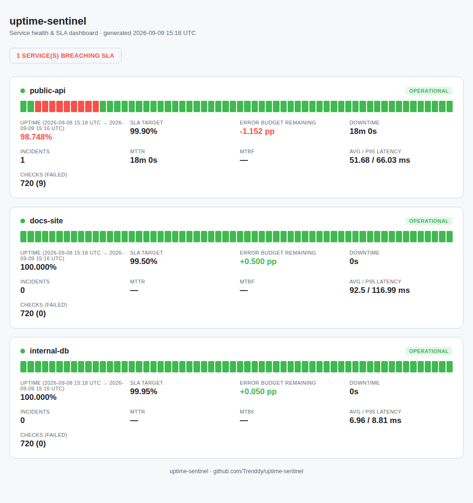

# uptime-sentinel

A lightweight service uptime & SLA monitor: it checks HTTP endpoints and TCP
ports on a schedule, tracks every result in SQLite, turns that history into
real SLA numbers (uptime %, error budget, MTTR, MTBF), fires alerts on state
changes, and renders a static status dashboard you can open in a browser.

No external services required — it runs anywhere Python runs, with zero
paid dependencies. Console alerting works out of the box; Slack alerting is
one webhook URL away.



## Why this exists

This started as a focused, timeboxed build: pick something a Production
Support / Application Support / SRE team actually uses day to day, and build
a small, complete version of it — not a toy. Uptime and SLA tracking is a
good fit because it sits at the center of that job: knowing a service is
down before a customer tells you, being able to say "we were at 99.87%
against a 99.9% target this month, here's the one incident that caused it,"
and having a status page to point people at during an incident review.

It builds on the AWS/CloudTrail-focused tooling in my other repos
([Security Runbooks](https://github.com/Trenddy), CloudTrail Log Analyzer),
but deliberately isn't AWS-specific — HTTP and TCP checks work against
anything, which matches how broadly "application support" roles are scoped.

## What it actually does

- **Checks services on a schedule** — HTTP (status code + latency) and raw
  TCP (host:port reachability), each with its own timeout and interval.
- **Persists every result to SQLite** — so SLA math is computed over real
  history, not just "is it up right now."
- **Computes SLA metrics that matter operationally**, time-weighted rather
  than check-count-weighted:
  - Uptime % over the observed window
  - Error budget remaining (in percentage points against the target)
  - Incident count, with each incident's start/end/duration
  - MTTR (mean time to recovery) and MTBF (mean time between failures)
  - Average and p95 latency
- **Alerts on state transitions, not every check** — a service that's been
  down for an hour doesn't spam you every 30 seconds; you get one "down"
  alert and one "recovered" alert. Alerting is pluggable (console + Slack
  webhook included); adding PagerDuty/email/Teams is "write one class."
- **Renders a static HTML dashboard** (`docs/report.html`) — one file, no
  build step, no JS framework. Shows per-service status, a recent-checks
  strip, and every SLA metric above. Dark/light aware.

## Quickstart

```bash
git clone https://github.com/Trenddy/uptime-sentinel.git
cd uptime-sentinel
pip install -r requirements-dev.txt   # or requirements.txt if you don't need to run tests
pip install -e .

cp config.example.yaml config.yaml    # edit the service list to point at real endpoints
uptime-sentinel run --once            # one check sweep, persisted
uptime-sentinel status                # quick text SLA summary
uptime-sentinel report                # writes docs/report.html — open it in a browser
```

Don't have real endpoints handy? Seed realistic synthetic history (including
a sample outage) and skip straight to the dashboard:

```bash
uptime-sentinel demo
uptime-sentinel report --config config.example.yaml
```

To actually monitor something continuously:

```bash
uptime-sentinel run          # loops forever on each service's configured interval, Ctrl+C to stop
```

## Configuration

Services live in `config.yaml` (gitignored — copy it from
`config.example.yaml` so real internal hostnames never get committed):

```yaml
services:
  - name: public-api
    url: https://api.example.com/health
    type: http
    expected_status: 200
    timeout_seconds: 5
    sla_target: 99.9

  - name: internal-db
    host: db.internal.example.com
    port: 5432
    type: tcp
    timeout_seconds: 3
    sla_target: 99.95

alerting:
  console: true
  slack:
    enabled: true
    webhook_url: "https://hooks.slack.com/services/..."
```

## Design notes


- **Time-weighted uptime, not check-count-weighted.** A service checked
  every 10 seconds that fails for 2 minutes has 2 minutes of downtime,
  whether that was 12 failing checks or 2. Counting checks instead of time
  would make uptime % depend on your polling interval, which isn't
  meaningful.
- **Alerts fire on transitions, not on every failing check.** The
  `AlertManager` tracks last-known state per service so a prolonged outage
  produces exactly one "down" and one "recovered" event, not one per poll.
- **SQLite over JSON-lines.** SLA math needs range queries ("all checks for
  service X in the last 24h"); SQLite makes that a real `WHERE` clause
  instead of hand-rolled filtering, while staying a single file with
  nothing to stand up.
- **Stdlib-only for the checks themselves** (`urllib`, `socket`) — no
  `requests` dependency for something this small, and one less thing to
  explain in a security review.

## Project layout

```
uptime_sentinel/
  monitor.py    # HTTP + TCP check backends
  storage.py    # SQLite persistence
  sla.py        # uptime / error budget / MTTR / MTBF math
  alerting.py   # console + Slack alert backends, transition-based
  report.py     # static HTML dashboard renderer
  cli.py        # check / run / status / report / demo commands
tests/          # pytest — SLA math, storage round-trips, alert transitions
.github/workflows/ci.yml   # runs the test suite + a CLI smoke test on push
```

## Testing

```bash
pytest -v
```

21 tests covering the SLA math (incident grouping, uptime calculation,
error budget, MTTR/MTBF, latency percentiles), storage round-trips, alert
transition logic, and the check backends. CI runs this on Python 3.10–3.12
on every push, plus a smoke test of the full `demo → status → report` flow.

## Possible next steps

- Historical trend charts (uptime by day/week) instead of just the current window
- A `--period` flag on `status`/`report` to scope SLA calculations to a rolling window instead of all-time
- PagerDuty / email alert backends alongside Slack
- Multi-region checks (run the same probe from more than one vantage point)

## License

MIT — see [LICENSE](LICENSE).
